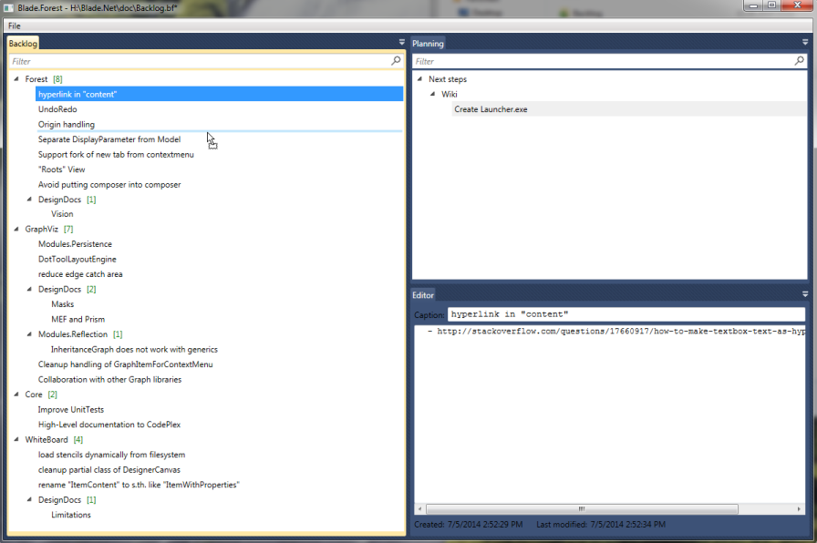

Do you find your self often in tiny 2-4-man or even 1-man-projects?

Of course also such small projects have its todos - things which popup in your mind but you don't want to
address immediately. So you start a good, old todo text file and everything is good ... **unless the file 
reaches 2 to 3 screen pages and you start loosing the overview** ...

So you pick one of the great issue trackers freely available out there? With SQL database, web server & issue formulars?

**Plainion.Forest** puts itself in between - between simple todo text files and real issue trackers.
It is

- simple desktop application
- uses trees of subjects to structure todos
- allows simple rearange of todos with D&D
- provides separate area for the todo "body"
- saves every todo in a separate file to perfectly support distributed version control systems by
  minimizing merge overhead

# Installation

Just download the [latest release](https://github.com/plainionist/Plainion.Forest/releases), unpack it whereever you want and run the executable. 

# Usage

Use the context menu to add and delete items.

Use Drag&Drop to reorganize the tree.
